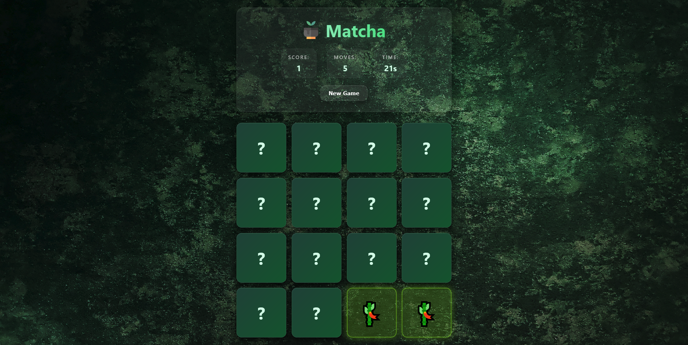

# 🎮 Matcha - Find The Perfect Pair

<div align="center">


**A fun and interactive memory card matching game built with React!**

[Demo](#-demo) • [Features](#-features) • [Installation](#-installation) • [How to Play](#-how-to-play) • [Technologies](#-technologies)

</div>

---

## 📸 Demo

<div align="center">
  
  <p><i>Match all the cards to win!</i></p>
</div>

## ✨ Features

- 🎯 **16 Cards** - 8 unique emoji pairs to match
- 🔄 **Random Shuffle** - Cards are shuffled every game for endless replayability
- 🎨 **Beautiful UI** - Clean and modern card flip animations
- 🏆 **Score Tracking** - Keep track of your matches
- 📊 **Move Counter** - See how many moves it takes to complete the game
- 🔒 **Smart Lock** - Prevents clicking during card comparison
- ♻️ **Reset Button** - Start a new game anytime
- 📱 **Responsive Design** - Play on any device

## 🚀 Installation

### Prerequisites

- Node.js (v14 or higher)
- npm or yarn

### Steps

1. **Clone the repository**
   ```bash
   git clone https://github.com/yourusername/memory-card-game.git
   cd memory-card-game
   ```

2. **Install dependencies**
   ```bash
   npm install
   # or
   yarn install
   ```

3. **Start the development server**
   ```bash
   npm start
   # or
   yarn start
   ```

4. **Open your browser**
   
   Navigate to `http://localhost:3000` to play the game!

## 🎮 How to Play

1. **Start the Game** - All cards are face down at the beginning
2. **Click a Card** - Flip a card to reveal the emoji
3. **Find the Match** - Click another card to find its matching pair
4. **Match or Flip Back** - If cards match, they stay face up. If not, they flip back after a short delay
5. **Complete the Game** - Match all 8 pairs to win!
6. **Beat Your Score** - Try to complete the game in fewer moves

## 🛠️ Technologies

This project is built with:

- **React** - Frontend library for building the UI
- **JavaScript (ES6+)** - Core programming language
- **CSS3** - Styling and animations
- **React Hooks** - useState, useEffect for state management

## 📁 Project Structure

```
Matcha/
├── src/
    ├── hooks/
│   │   ├── useGameLogic.js   #Main game logic 
│   ├── components/
│   │   ├── Card.jsx          # Individual card component
│   │   └── GameHeader.jsx    # Header with score and moves
│   ├── App.jsx               
│   ├── index.js              # Entry point
│   └── styles/
│       └── App.css           # Styling
├── public/
├── package.json
└── README.md
```

## 🎯 Game Logic

### Card Matching Algorithm

1. First card click → Card flips and stays open
2. Second card click → Card flips
3. **If match:** Both cards stay open and marked as matched
4. **If no match:** Both cards flip back after 500ms delay
5. Board locks during comparison to prevent additional clicks

### State Management

The game uses React hooks to manage:
- **cards** - Array of all card objects with flip/match states
- **flippedCards** - IDs of currently flipped cards
- **matchedCards** - IDs of successfully matched cards
- **score** - Number of successful matches
- **moves** - Total number of move pairs made
- **isLocked** - Prevents clicking during card comparison

## 🎨 Customization

### Change Card Emojis

Edit the `cardValues` array in `App.jsx`:

```javascript
const cardValues = [
  "🎮", "🎧", "🎸", "🎥",
  "🚲", "✈️", "🚗", "🚀"
];
```

### Adjust Timing

Modify the setTimeout delays in `handleCardClick`:

```javascript
setTimeout(() => {
  // Card flip back logic
}, 500); // Change this value (in milliseconds)
```

## 🤝 Contributing

Contributions are welcome! Here's how you can help:

1. Fork the repository
2. Create a new branch (`git checkout -b feature/AmazingFeature`)
3. Commit your changes (`git commit -m 'Add some AmazingFeature'`)
4. Push to the branch (`git push origin feature/AmazingFeature`)
5. Open a Pull Request

## 👨‍💻 Author

**Muhammad Abdullah**

- GitHub: [@m-abdullah-06](https://github.com/m-abdullah-06)
- LinkedIn: [Muhammad Abdullah](https://www.linkedin.com/in/muhammad-abdullah-09390938a)

## 🙏 Acknowledgments

- Emoji icons from Unicode Standard
- Inspiration from classic memory card games
- React community for amazing tools and resources

---

<div align="center">

**⭐ Star this repo if you enjoyed the game! ⭐**

Made with ❤️ and React

</div>
